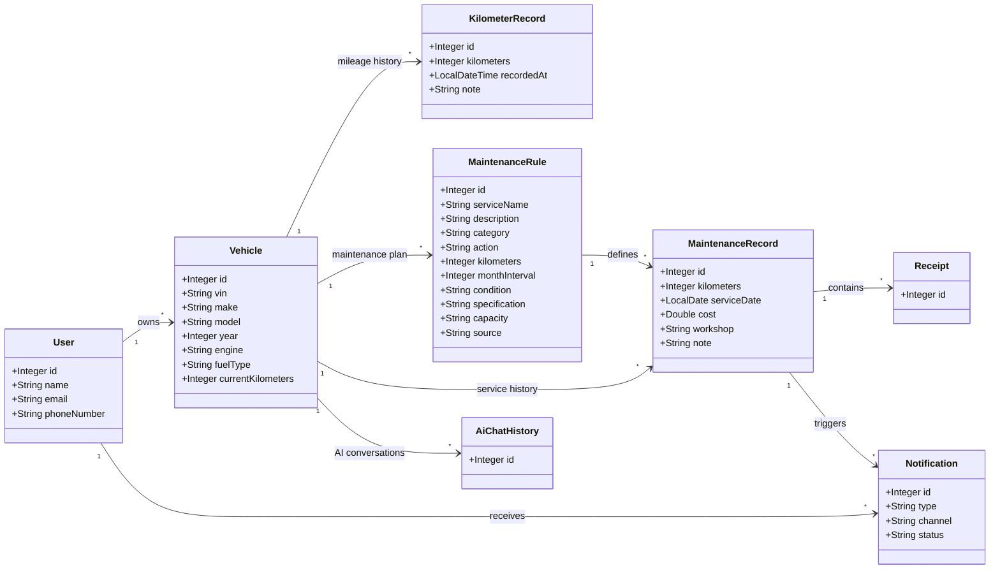

# صَيّان | Sayyan

### Smart Vehicle Care & Maintenance Platform

**Sayyan** is a smart vehicle care platform designed to help vehicle owners manage their cars, track mileage, organize maintenance, store service records and receipts, receive maintenance notifications, and access AI-powered vehicle assistance.

---

## Team Members

- Nawaf
- Thikra
- Subhiyyah

---

## Overview

Vehicle owners often have maintenance information scattered across different places, making it difficult to track mileage, maintenance schedules, service history, receipts, and upcoming maintenance.

**Sayyan** provides a centralized vehicle care system that helps users organize and understand their vehicle's maintenance throughout the ownership lifecycle.

The platform allows users to:

- Manage multiple vehicles.
- Track vehicle mileage over time.
- Manage vehicle maintenance requirements.
- Record completed maintenance services.
- Store maintenance receipts.
- Receive maintenance notifications.
- Maintain vehicle-specific AI conversation history.
- Use AI-assisted features to better understand vehicle problems and maintenance information.

The backend is built using **Java and Spring Boot** with a relational database connecting users, vehicles, maintenance information, mileage history, and completed services.

---

## Tech Stack

| Technology | Usage |
|---|---|
| Java | Core programming language |
| Spring Boot | Backend framework |
| Spring Web | REST API development |
| Spring Data JPA | Database access |
| Hibernate | ORM and entity relationships |
| MySQL | Relational database |
| Jakarta Validation | Data validation |
| Lombok | Reducing boilerplate code |
| Spring AI | AI integration |
| REST Client | External API communication |
| Maven | Dependency management |

---

# Database Design

Sayyan uses a relational database consisting of **8 main entities**, with the `Vehicle` entity acting as the central part of the system.

## UML Diagram



---

## Entities

### User

Represents a registered vehicle owner.

The user can:

- Own multiple vehicles.
- Receive multiple notifications.

---

### Vehicle

Represents a vehicle registered under a user.

It stores information such as:

- VIN
- Make
- Model
- Year
- Engine
- Fuel type
- Current kilometers

The vehicle acts as the central entity connecting the major parts of the platform.

---

### KilometerRecord

Stores historical odometer readings for a vehicle.

Instead of keeping only the current mileage, Sayyan maintains a history of kilometer readings that can be used to understand how the vehicle is being driven over time.

Each kilometer record belongs to one vehicle.

---

### MaintenanceRule

Represents a maintenance requirement associated with a specific vehicle.

A maintenance rule can contain:

- Service name
- Description
- Category
- Action
- Kilometer requirement
- Month interval
- Condition
- Specification
- Capacity
- Source

Each maintenance rule belongs to one vehicle.

---

### MaintenanceRecord

Represents a maintenance service that has actually been performed on a vehicle.

It can store:

- Service kilometers
- Service date
- Cost
- Workshop
- Notes

Each maintenance record belongs to a vehicle and is connected to a maintenance rule.

---

### Receipt

Represents a receipt associated with a completed maintenance service.

Receipts allow the user to keep supporting documentation connected to the vehicle's maintenance history.

Each receipt belongs to one maintenance record.

---

### Notification

Represents maintenance-related notifications sent to users.

Notifications can be used to inform the vehicle owner about important maintenance events and reminders.

Each notification belongs to a user and can be associated with a maintenance record.

---

### AiChatHistory

Stores AI conversation history associated with a specific vehicle.

This allows AI interactions to remain connected to the relevant vehicle and its context.

Each AI chat history record belongs to one vehicle.

---

## Relationship Summary

| Parent | Relationship | Child | Purpose |
|---|---|---|---|
| User | One-to-Many | Vehicle | A user can own multiple vehicles |
| User | One-to-Many | Notification | A user can receive multiple notifications |
| Vehicle | One-to-Many | KilometerRecord | Stores mileage history |
| Vehicle | One-to-Many | MaintenanceRule | Stores the vehicle maintenance plan |
| Vehicle | One-to-Many | MaintenanceRecord | Stores completed maintenance history |
| Vehicle | One-to-Many | AiChatHistory | Stores vehicle-specific AI conversations |
| MaintenanceRule | One-to-Many | MaintenanceRecord | Links completed services to maintenance rules |
| MaintenanceRecord | One-to-Many | Receipt | Stores service receipts |
| MaintenanceRecord | One-to-Many | Notification | Connects maintenance events to notifications |

---

# CRUD API

The project provides CRUD operations for the main entities.

## User

**Base URL**

```http
/api/v1/user
```

| Method | Endpoint | Description |
|---|---|---|
| GET | `/get-all` | Get all users |
| GET | `/get/{id}` | Get user by ID |
| POST | `/add` | Add a new user |
| PUT | `/update/{id}` | Update a user |
| DELETE | `/delete/{id}` | Delete a user |

---

## Vehicle

**Base URL**

```http
/api/v1/vehicle
```

| Method | Endpoint | Description |
|---|---|---|
| GET | `/get-all` | Get all vehicles |
| GET | `/get/{userId}/{vehicleId}` | Get a specific vehicle belonging to a user |
| GET | `/get/user/{userId}` | Get all vehicles belonging to a user |
| POST | `/add/{userId}` | Add a vehicle to a user |
| PUT | `/update/{userId}/{vehicleId}` | Update a vehicle |
| DELETE | `/delete/{userId}/{vehicleId}` | Delete a vehicle |

---

## Kilometer Record

**Base URL**

```http
/api/v1/kilometer-record
```

| Method | Endpoint | Description |
|---|---|---|
| GET | `/get-all` | Get all kilometer records |
| GET | `/get/{userId}/{vehicleId}/{id}` | Get a kilometer record |
| POST | `/add/{userId}/{vehicleId}` | Add a kilometer record |
| PUT | `/update/{userId}/{vehicleId}/{id}` | Update a kilometer record |
| DELETE | `/delete/{userId}/{vehicleId}/{id}` | Delete a kilometer record |

---

## Maintenance Rule

**Base URL**

```http
/api/v1/maintenance-rule
```

| Method | Endpoint | Description |
|---|---|---|
| GET | `/get-all` | Get all maintenance rules |
| GET | `/get/{id}` | Get maintenance rule by ID |
| POST | `/add/{vehicleId}` | Add a maintenance rule to a vehicle |
| PUT | `/update/{id}` | Update a maintenance rule |
| DELETE | `/delete/{id}` | Delete a maintenance rule |

---

## Maintenance Record

**Base URL**

```http
/api/v1/maintenance-record
```

| Method | Endpoint | Description |
|---|---|---|
| GET | `/get-all` | Get all maintenance records |
| GET | `/get/{id}` | Get maintenance record by ID |
| POST | `/add/{vehicleId}/{maintenanceRuleId}` | Add a completed maintenance record |
| PUT | `/update/{id}` | Update a maintenance record |
| DELETE | `/delete/{id}` | Delete a maintenance record |

---

## Receipt

**Base URL**

```http
/api/v1/receipt
```

| Method | Endpoint | Description |
|---|---|---|
| GET | `/get-all` | Get all receipts |
| GET | `/get/{id}` | Get receipt by ID |
| POST | `/add/{maintenanceRecordId}` | Add a receipt to a maintenance record |
| PUT | `/update/{id}` | Update a receipt |
| DELETE | `/delete/{id}` | Delete a receipt |

---

## Notification

**Base URL**

```http
/api/v1/notification
```

| Method | Endpoint | Description |
|---|---|---|
| GET | `/get-all` | Get all notifications |
| GET | `/get/{id}` | Get notification by ID |
| POST | `/add/{userId}` | Add a notification |
| PUT | `/update/{id}` | Update a notification |
| DELETE | `/delete/{id}` | Delete a notification |

---

## AI Chat History

**Base URL**

```http
/api/v1/ai-chat-history
```

| Method | Endpoint | Description |
|---|---|---|
| GET | `/get-all` | Get all AI chat history |
| GET | `/get/{id}` | Get AI chat history by ID |
| POST | `/add/{vehicleId}` | Add AI chat history for a vehicle |
| PUT | `/update/{id}` | Update AI chat history |
| DELETE | `/delete/{id}` | Delete AI chat history |

---

# Architecture

Sayyan follows a layered Spring Boot architecture to separate responsibilities between different parts of the application.

```text
Client
  │
  ▼
Controller
  │
  ▼
Service
  │
  ▼
Repository
  │
  ▼
MySQL Database
```

## Controller Layer

Handles incoming HTTP requests and exposes the REST API.

## Service Layer

Contains the application's business logic and coordinates operations between controllers, repositories, and external services.

## Repository Layer

Provides database access using Spring Data JPA.

## Model Layer

Defines the database entities and relationships.

## DTO Layer

Provides structured objects for transferring data between different parts of the application without exposing unnecessary entity data.

## Client Layer

Handles communication with external APIs and external services used by the platform.

---

# Project Structure

```text
src/main/java/com/nawaf/capstone3
│
├── Advice
├── Api
├── Client
├── Controller
├── DTO
├── Model
├── Repository
├── Service
│
└── Capstone3Application.java
```

---

# Core System Flow

```text
User
 │
 ▼
Vehicle
 │
 ├──────────────► Kilometer Tracking
 │
 ├──────────────► Maintenance Rules
 │                       │
 │                       ▼
 │               Maintenance Records
 │                       │
 │                  ┌────┴────┐
 │                  ▼         ▼
 │               Receipt   Notification
 │
 └──────────────► AI Assistance
```

The vehicle acts as the center of the Sayyan ecosystem. Its mileage, maintenance requirements, completed services, receipts, notifications, and AI interactions are organized around a single vehicle profile.

---

# Project Goal

**صَيّان | Sayyan** aims to simplify vehicle ownership by bringing important vehicle information into one centralized platform.

The system combines:

**Vehicle Management → Mileage Tracking → Maintenance Planning → Service History → Notifications → AI Assistance**

This allows vehicle owners to better understand their vehicles, maintain them on time, and keep their ownership history organized.

---

## صَيّان | Sayyan

> **Know your vehicle. Maintain it on time. Keep its history organized.**
